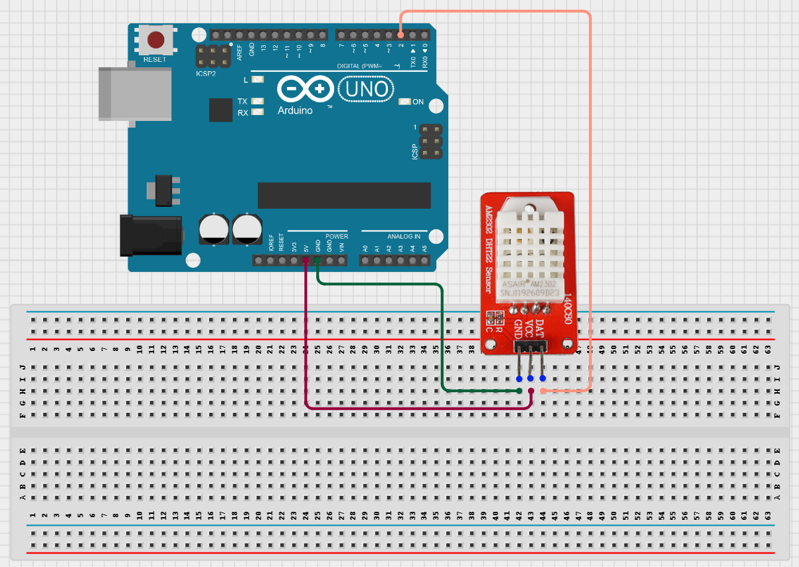
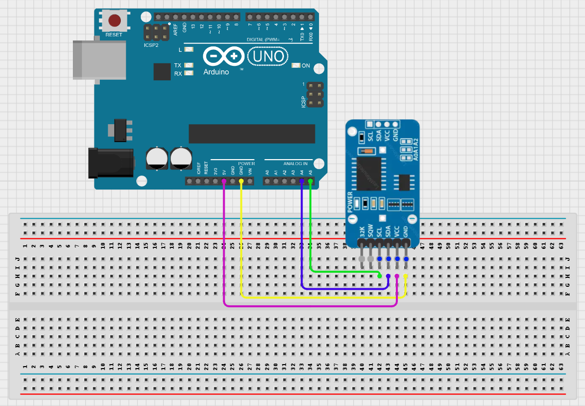
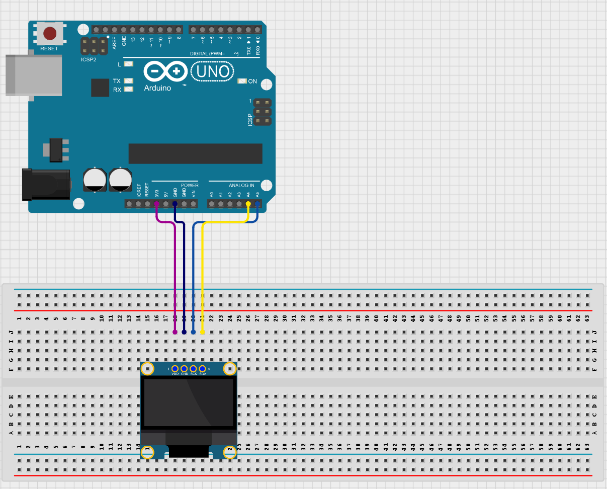
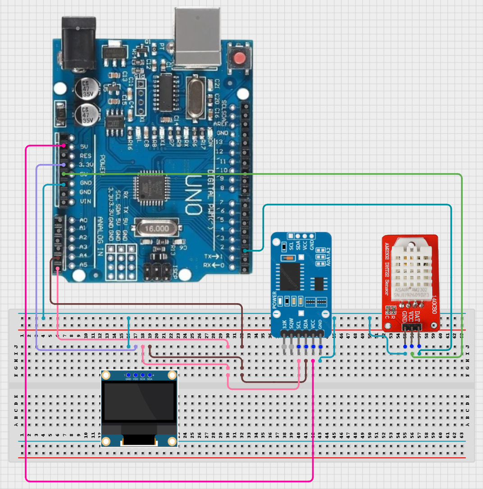

 # Temperature & Humidity Monitor

## Project Overview

The goal of this project is to display the temperature and humidity along with an accurate date and time on an OLED screen that refreshes every second. 
This could have many uses such as monitoring devices and components to make sure they don’t overheat or simply to make environmental observations. 
Each module was set up and tested one by one to make sure each was working as it should, then it was all hooked up together on a breadboard and connected to the Arduino board in order to get this final result:

### Project Objectives

- Set up the DHT22 sensor with the Arduino to check that it functions properly.  
- Set up and configure the right date and time on the DS3231 clock module with the Arduino.  
- Set up the OLED screen and test it with the Arduino.  
- Plug all components in together and make sure they’re working properly.  
- Display date, time, temperature, and humidity accurately on the OLED screen and have it update continuously.

### Components

* Arduino Uno R3 (Clone/Compatible board) w/ USB-C cable: [AliExpress link](https://www.aliexpress.us/item/3256807149536177.html?invitationCode=M2Z4WmpJTUpwNmo2dmh1aDQ3TGJxZklSZFZpQWpVRjZMZzQxKzU1MVJVZWVQemFTZUJrNWVWT0s1MU1hdTAyWg&srcSns=sns_Copy&spreadType=socialShare&social_params=21948505516&bizType=ProductDetail&spreadCode=M2Z4WmpJTUpwNmo2dmh1aDQ3TGJxZklSZFZpQWpVRjZMZzQxKzU1MVJVZWVQemFTZUJrNWVWT0s1MU1hdTAyWg&aff_fcid=29958ca20822478a81153024c5cb4a09-1758824388982-06983-_mqwdyfL&tt=MG&aff_fsk=_mqwdyfL&aff_platform=default&sk=_mqwdyfL&aff_trace_key=29958ca20822478a81153024c5cb4a09-1758824388982-06983-_mqwdyfL&shareId=21948505516&businessType=ProductDetail&platform=AE&terminal_id=6a4296ada9bc4463b7c62df1927f5f9e&afSmartRedirect=y&gatewayAdapt=glo2usa4itemAdapt) - $3.52 USD  
* DHT22 Digital Temperature & Humidity Sensor Module: [AliExpress link](https://www.aliexpress.us/item/2251832573586959.html?invitationCode=M2Z4WmpJTUpwNmlEbVJMOFdyNXdNZklSZFZpQWpVRjZMZzQxKzU1MVJVZWVQemFTZUJrNWVWT0s1MU1hdTAyWg&srcSns=sns_Copy&spreadType=socialShare&social_params=21936422706&bizType=ProductDetail&spreadCode=M2Z4WmpJTUpwNmlEbVJMOFdyNXdNZklSZFZpQWpVRjZMZzQxKzU1MVJVZWVQemFTZUJrNWVWT0s1MU1hdTAyWg&aff_fcid=60c36b6a139f4015843e53c858b0a6b5-1758827087625-02850-_mt4LseD&tt=MG&aff_fsk=_mt4LseD&aff_platform=default&sk=_mt4LseD&aff_trace_key=60c36b6a139f4015843e53c858b0a6b5-1758827087625-02850-_mt4LseD&shareId=21936422706&businessType=ProductDetail&platform=AE&terminal_id=6a4296ada9bc4463b7c62df1927f5f9e&afSmartRedirect=y&gatewayAdapt=glo2usa4itemAdapt) - $1.90 USD  
* DS3231 Real-Time Clock Module: [AliExpress link](https://www.aliexpress.us/item/3256806957282138.html?invitationCode=M2Z4WmpJTUpwNmdGVXBCb2dsMzlSL0lSZFZpQWpVRjZMZzQxKzU1MVJVZWVQemFTZUJrNWVWT0s1MU1hdTAyWg&srcSns=sns_Copy&spreadType=socialShare&social_params=21948506328&bizType=ProductDetail&spreadCode=M2Z4WmpJTUpwNmdGVXBCb2dsMzlSL0lSZFZpQWpVRjZMZzQxKzU1MVJVZWVQemFTZUJrNWVWT0s1MU1hdTAyWg&aff_fcid=b379baa01e484ffa85aa4fa540ba9bac-1758824392893-08877-_mPZKycN&tt=MG&aff_fsk=_mPZKycN&aff_platform=default&sk=_mPZKycN&aff_trace_key=b379baa01e484ffa85aa4fa540ba9bac-1758824392893-08877-_mPZKycN&shareId=21948506328&businessType=ProductDetail&platform=AE&terminal_id=6a4296ada9bc4463b7c62df1927f5f9e&afSmartRedirect=y&gatewayAdapt=glo2usa4itemAdapt) - $1.70 USD  
* 0.96” OLED Display Screen Module (Blue): [AliExpress link](https://www.aliexpress.us/item/3256807960975958.html?invitationCode=M2Z4WmpJTUpwNml1YWdqWmsxWGVOL0lSZFZpQWpVRjZMZzQxKzU1MVJVZWVQemFTZUJrNWVWT0s1MU1hdTAyWg&srcSns=sns_Copy&spreadType=socialShare&social_params=21931018413&bizType=ProductDetail&spreadCode=M2Z4WmpJTUpwNml1YWdqWmsxWGVOL0lSZFZpQWpVRjZMZzQxKzU1MVJVZWVQemFTZUJrNWVWT0s1MU1hdTAyWg&aff_fcid=3caf23587ff04c42b836f63e8beaf95c-1758824385557-07362-_mqHjlTP&tt=MG&aff_fsk=_mqHjlTP&aff_platform=default&sk=_mqHjlTP&aff_trace_key=3caf23587ff04c42b836f63e8beaf95c-1758824385557-07362-_mqHjlTP&shareId=21931018413&businessType=ProductDetail&platform=AE&terminal_id=6a4296ada9bc4463b7c62df1927f5f9e&afSmartRedirect=y&gatewayAdapt=glo2usa4itemAdapt) - $4.44 USD  
* Breadboard (830 point): [AliExpress link](https://www.aliexpress.us/item/3256807960975958.html?invitationCode=M2Z4WmpJTUpwNml1YWdqWmsxWGVOL0lSZFZpQWpVRjZMZzQxKzU1MVJVZWVQemFTZUJrNWVWT0s1MU1hdTAyWg&srcSns=sns_Copy&spreadType=socialShare&social_params=21931018413&bizType=ProductDetail&spreadCode=M2Z4WmpJTUpwNml1YWdqWmsxWGVOL0lSZFZpQWpVRjZMZzQxKzU1MVJVZWVQemFTZUJrNWVWT0s1MU1hdTAyWg&aff_fcid=3caf23587ff04c42b836f63e8beaf95c-1758824385557-07362-_mqHjlTP&tt=MG&aff_fsk=_mqHjlTP&aff_platform=default&sk=_mqHjlTP&aff_trace_key=3caf23587ff04c42b836f63e8beaf95c-1758824385557-07362-_mqHjlTP&shareId=21931018413&businessType=ProductDetail&platform=AE&terminal_id=6a4296ada9bc4463b7c62df1927f5f9e&afSmartRedirect=y&gatewayAdapt=glo2usa4itemAdapt) - $2.53 USD  
* DuPont Wires (Male to Male): [AliExpress link](https://www.aliexpress.us/item/3256806885766712.html?invitationCode=M2Z4WmpJTUpwNmpkY3Q2UUlCNXQzL0lSZFZpQWpVRjZMZzQxKzU1MVJVZWVQemFTZUJrNWVWT0s1MU1hdTAyWg&srcSns=sns_Copy&spreadType=socialShare&social_params=21931020028&bizType=ProductDetail&spreadCode=M2Z4WmpJTUpwNmpkY3Q2UUlCNXQzL0lSZFZpQWpVRjZMZzQxKzU1MVJVZWVQemFTZUJrNWVWT0s1MU1hdTAyWg&aff_fcid=eb3fc66453534202a156eb965b60886f-1758824395255-00380-_mL35CY9&tt=MG&aff_fsk=_mL35CY9&aff_platform=default&sk=_mL35CY9&aff_trace_key=eb3fc66453534202a156eb965b60886f-1758824395255-00380-_mL35CY9&shareId=21931020028&businessType=ProductDetail&platform=AE&terminal_id=6a4296ada9bc4463b7c62df1927f5f9e&afSmartRedirect=y&gatewayAdapt=glo2usa4itemAdapt) - $3.17 USD

### Libraries Used
Adafruit BusIO, Adafruit GFX Library, Adafruit SSD1306, Adafruit Unified Sensor, DHT Sensor Library, and RTClib, all by Adafruit.   
All can be downloaded in the Library Manager in the Arduino IDE.

## Project Setup

### Setting up the DHT22:

**Pin connections:**

| DHT22 | Arduino |
| --- | --- |
| GND | GND |
| VCC | 5V |
| DAT | Pin 2 |

**Wiring diagram:**

Start by hooking up the module to the board as shown above with a breadboard and some DuPont wires, then, download the DHT Sensor Library by Adafruit and the Adafruit Unified Sensor library in the Arduino IDE’S Library Manager. The next step is to program it, and in this [example code](DHT22-Setup/sketch_dhtsetup.ino) you’ll see how I turned it on and displayed the temperature and humidity.   

I followed this [tutorial by Paul McWhorter](https://www.youtube.com/watch?v=-AvF2TsB2GI) to figure out how to set this up.

### Setting up the DS3231:

**Pin Connections:**

| DS3231 | Arduino |
| --- | --- |
| GND |  GND |
| VCC | 5V |
| SDA | A4 |
| SCL | A5 |

**Wiring Diagram:**

Once again, start by hooking up the module to the board with a breadboard and dupont wires, as shown above, then you’ll need to download the Adafruit BusIO and RTClib libraries. After that, you’ll need to set the time and date once as shown in the code below. Please note that this module can also be equipped with a battery so that it can keep the time even when unplugged.

The RTClib library I've linked [here](https://github.com/adafruit/RTClib/blob/master/examples/ds3231/ds3231.ino) has many examples for how to setup this module that I referred to to set this up in my own example code [here](DS3231-Setup/sketch_rtcsetup.ino).

### Setting up the OLED:

**Pin Connections:**

| OLED | Arduino |
| --- | --- |
| GND | GND |
| VCC | 3.3V |
| SCL | A5 |
| SDA | A4 |

**Wiring Diagram:**

This is the example code provided by the Adafruit SSD1306 library, you can access it after downloading it in the Arduino IDE along with the Adafruit GFX Library. After the download go  to File > Examples > Examples from Custom Libraries > Adafruit SSD1306 > ssd1306_128x64_spi. You can also find it on their [GitHub page](https://github.com/SolderedElectronics/Soldered-OLED-Display-Arduino-Library/blob/main/examples/Drawing_Example/Drawing_Example.ino).

### Final product:

**Wiring diagram:**

Now all that’s left is to put it all together as shown in this diagram above, to program it we simply need to start by getting all our readings from the sensor and clock, and automatically show it on the screen, then repeat the process and refresh the values every second. [This is how I did it](Temp&HumidityDisplay).
